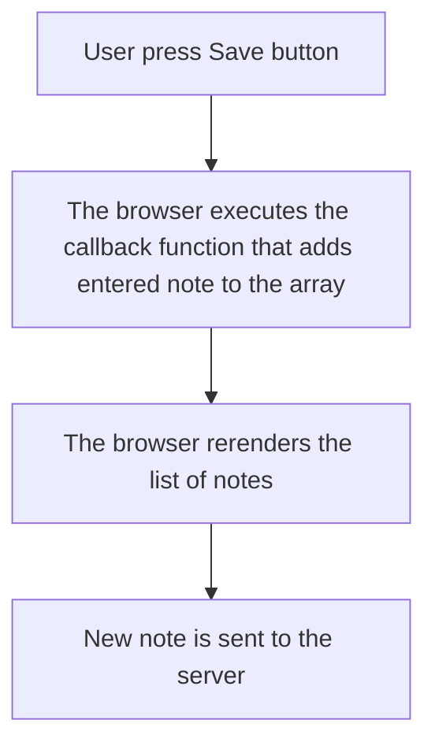

```mermaid
flowchart TD
  A[User press Save button] --> 
  B[The browser executes the callback function that adds entered note to the array]
  B --> C[The browser rerenders the list of notes]
  C --> D[New note is sent to the server]
```
